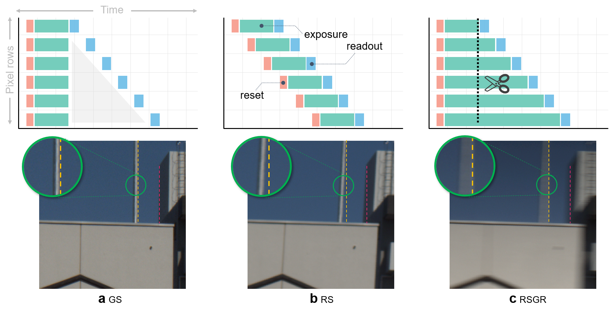

<!-- # NeuralGlobalShutter
Making RSGR (rolling shutter with global reset) alive -->

## Introduction

<div align="center">
  
</div>

**TL;DR:** we provide an alternative solution for rolling shutter rectification by making RSGR, a widely ignored feature of rolling shutter, alive. In this way, we turn the rectification problem into a deblur-like one.

Most computer vision systems assume distortion-free images as inputs. The widely used rolling-shutter (RS) image sensors, however, suffer from geometric distortion when the camera and object undergo motion during capture. Extensive researches have been conducted on correcting RS distortions. However, most of the existing work relies heavily on the prior assumptions of scenes or motions. Besides, the motion estimation steps are either oversimplified or computationally inefficient due to the heavy flow warping, limiting their applicability. In this work, we investigate using rolling shutter with a global reset feature (RSGR) to restore clean global shutter (GS) videos. This feature enables us to turn the rectification problem into a deblur-like one, getting rid of inaccurate and costly explicit motion estimation. First, we build an optic system that captures paired RSGR/GS videos. Second, we develop a novel algorithm incorporating spatial and temporal designs to correct the spatial-varying RSGR distortion. Third, we demonstrate that existing image-to-image translation algorithms can recover clean GS videos from distorted RSGR inputs, yet our algorithm achieves the best performance with the specific designs. Our rendered results are not only visually appealing but also beneficial to downstream tasks. Compared to the state-of-the-art RS solution, our RSGR solution is superior in both effectiveness and efficiency. Considering it is easy to realize without changing the hardware, we believe our RSGR solution can potentially replace the RS solution in taking distortion-free videos with low noise and low budget.

## Citation

If you find this project useful in your research, please consider cite:

```BibTeX
@inproceedings{Wang_2022_CVPR,
author = {Wang, Zhixiang and Ji, Xiang and Huang, Jia-Bin and Satoh, Shin'ichi and Zhou, Xiao and Zheng, Yinqiang},
title = {Neural Global Shutter: Learn to Restore Video from a Rolling Shutter Camera with Global Reset Feature},
booktitle = {Proceedings of the IEEE/CVF Conference on Computer Vision and Pattern Recognition (CVPR)},
month = {June},
year = {2022}
}
```